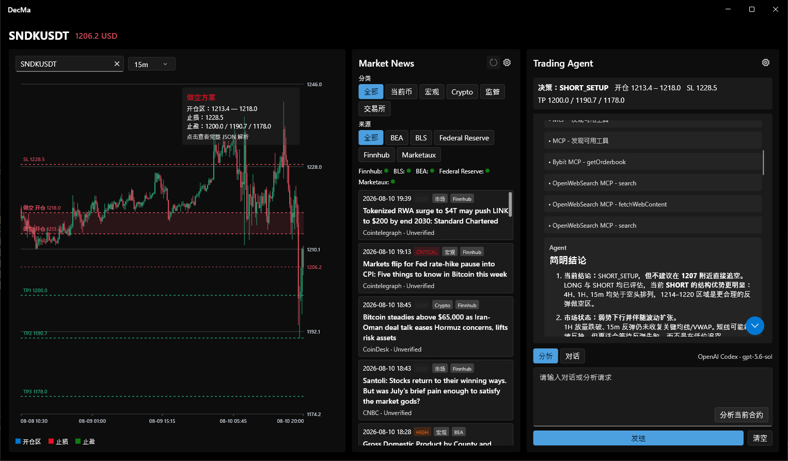
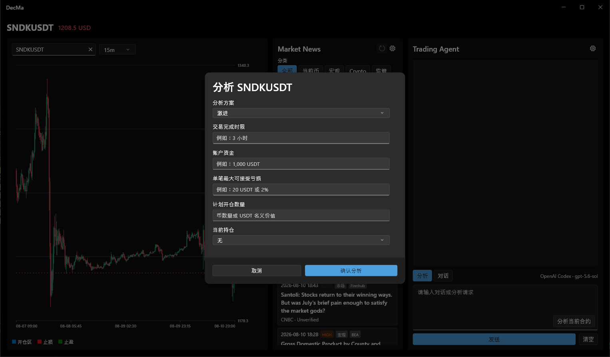
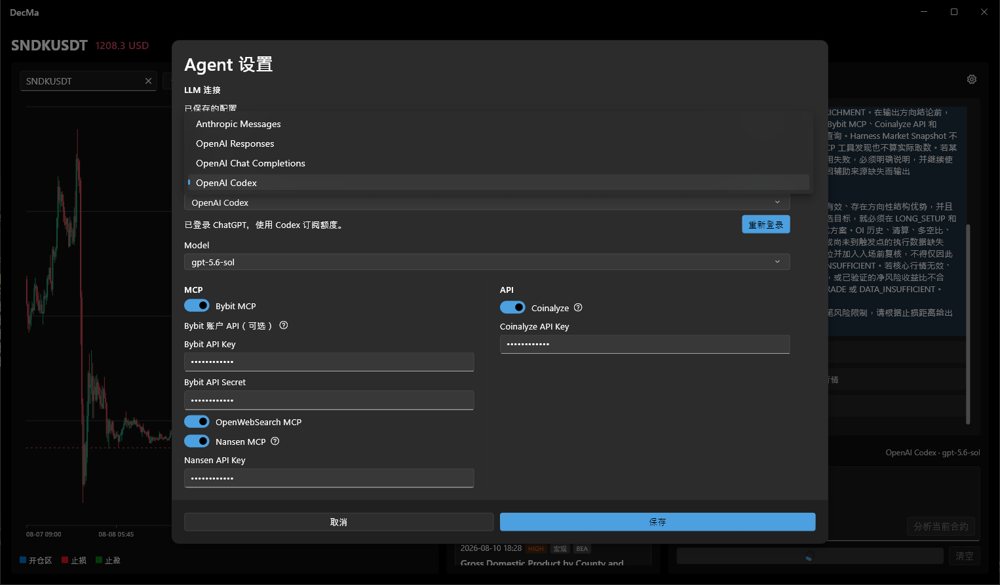
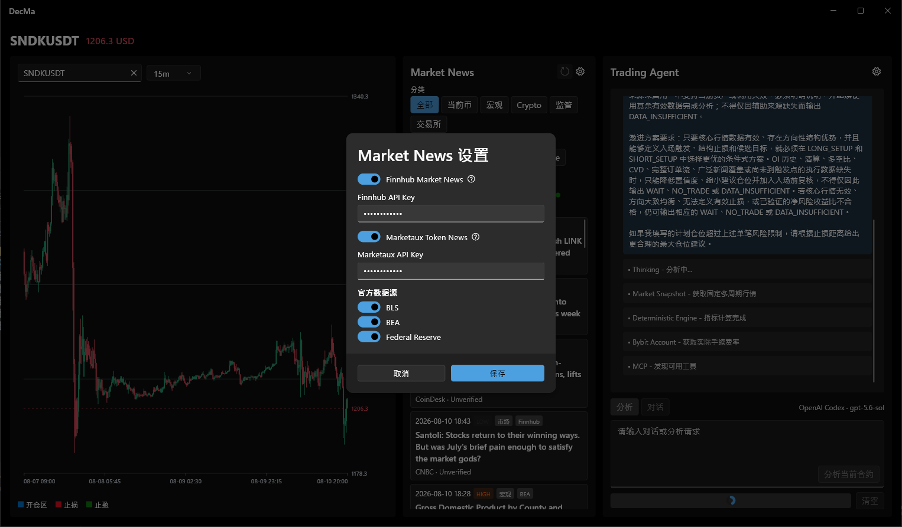

[English](README.md) | 简体中文

# DecMa

DecMa 是一款 Flutter 桌面端的 Bybit Linear 永续合约只读分析工作台。它将实时图表、筛选后的市场资讯、确定性市场指标、可选外部数据工具和 LLM Agent 整合在同一界面中。系统可给出候选开仓区、止损与止盈价位，但绝不会下单、修改订单或撤单。

## 截图

### 工作台

三栏工作台可同时查看图表、市场资讯和 Agent 输出。



### 结构化分析请求

发起分析前，可补充风险风格、预期交易时限、账户与亏损限制，以及可选的持仓信息。



### Agent 与数据源设置

可保存多个 LLM 连接；选择 OpenAI Codex 时可登录；也可以按需启用 MCP 和 API 数据源。



### 市场资讯设置

官方宏观资讯与可选的 Finnhub、Marketaux 资讯源可独立配置。



## 功能

- 搜索 Bybit Linear 永续合约并查看 1 分钟、5 分钟、15 分钟、1 小时、4 小时和日线 K 线。应用最多加载 1,000 根 K 线，并每秒刷新最新 K 线。
- 使用 Fluent UI 三栏桌面工作台，同时查看图表、可筛选的市场资讯与 Trading Agent。
- 支持结构化市场分析和连续对话两种模式。对话与先前分析上下文只保留在当前应用会话中。
- 每次分析会构建实时 Bybit 市场快照，并计算 5 分钟、15 分钟、1 小时和 4 小时级别的 EMA、MACD、RSI、ATR、VWAP、已实现波动率、成交量和振幅扩张等指标。
- 在图表绘制前校验模型返回的结构化计划；只有合约一致且价格关系有效时，才会显示开仓区、止损与止盈价位。
- 支持 Anthropic Messages、OpenAI Responses、兼容 OpenAI Chat Completions 的接口，以及 OpenAI Codex。可保存多个带名称的 LLM 连接；Codex 使用浏览器登录流程。
- 可选分析数据源包括 Bybit MCP、OpenWebSearch MCP、Nansen MCP 和 Coinalyze API。Bybit MCP 只暴露明确公开、只读的操作。
- 默认读取 BLS、BEA 和 Federal Reserve 的宏观与市场资讯；可选启用 Finnhub 和 Marketaux。资讯可按当前资产、分类和来源筛选。
- API Key 与 OAuth 凭据通过 `flutter_secure_storage` 保存；非敏感设置、已缓存事件、资产配置和最近查看的合约分别保存。
- 数据缺失、过期或互相矛盾时，Agent 会采取保守结论，可返回 `WAIT`、`NO_TRADE` 或 `DATA_INSUFFICIENT`，且没有交易执行能力。

## 环境要求

- Flutter SDK，Dart 版本为 `^3.12.2`。
- 一个 Flutter 桌面端目标：Windows、macOS 或 Linux。
- Anthropic Messages、OpenAI Responses 或 OpenAI Chat Completions 所需的 LLM API Key 与模型；或使用 OpenAI Codex 登录选项所需的 ChatGPT 账号。
- 若使用内置的 Bybit MCP 或 OpenWebSearch MCP，需要 Node.js 与 `npx`。图表、资讯源、Nansen MCP 和 Coinalyze 不依赖 Node.js。
- 启用 Nansen、Coinalyze、Finnhub 或 Marketaux 时，需要相应的可选 API Key。

首次请求内置 MCP 时，`npx` 可能下载对应的软件包，因此需要网络访问。

## 快速开始

```bash
# Fetch the Flutter packages.
flutter pub get

# Run the desktop target that matches your machine.
flutter run -d windows
```

请按实际系统将 `windows` 替换为 `macos` 或 `linux`。

## 配置 DecMa

### 1. 配置 LLM 连接

1. 启动 DecMa，在 **Trading Agent** 面板中点击设置图标。
2. 新建或选择已保存的连接，再选择接口类型。
3. 对于 Anthropic Messages、OpenAI Responses 或 OpenAI Chat Completions，填写接口地址、模型和 API Key。DecMa 会在接口地址后自动追加以下请求路径：

   | 接口类型 | 默认接口地址 | DecMa 自动追加的请求路径 |
   | --- | --- | --- |
   | Anthropic Messages | `https://api.anthropic.com` | `/v1/messages` |
   | OpenAI Responses | `https://api.openai.com/v1` | `/responses` |
   | OpenAI Chat Completions | `https://api.openai.com/v1` | `/chat/completions` |

4. 对于 **OpenAI Codex**，在浏览器中登录后选择模型。应用会使用该登录流程提供的 Codex 接口与凭据。
5. 保存设置。密钥输入框中的掩码文本保持不变时，系统会继续使用设备上已经保存的凭据。

### 2. 配置分析数据源

在 **Agent 设置** 中仅启用工作流需要的数据源：

| 数据源 | 默认状态 | 凭据 | 说明 |
| --- | --- | --- | --- |
| Bybit MCP | 启用 | 可选 Bybit API Key 和 Secret | 需要 Node.js 与 `npx`。应用只接纳明确公开、只读的 MCP 工具；可选账户凭据仅用于读取手续费率。 |
| OpenWebSearch MCP | 启用 | 无 | 需要 Node.js 与 `npx`。 |
| Nansen MCP | 关闭 | Nansen API Key | 可选的链上背景信息。 |
| Coinalyze API | 关闭 | Coinalyze API Key | 可选的衍生品数据；应用在本地限制为每分钟最多 40 个请求单位。 |

### 3. 配置市场资讯

在 **Market News** 面板点击设置图标，即可启用数据源并保存可选 API Key：

| 数据源 | 默认状态 | 凭据 | 用途 |
| --- | --- | --- | --- |
| BLS | 启用 | 无 | 美国官方劳工数据发布。 |
| BEA | 启用 | 无 | 美国官方经济数据发布。 |
| Federal Reserve | 启用 | 无 | 美联储新闻与数据发布。 |
| Finnhub | 关闭 | Finnhub API Key | 市场资讯。 |
| Marketaux | 关闭 | Marketaux API Key | 当前资产相关资讯。 |

应用每分钟检查一次资讯源，各来源会按自己的缓存周期决定是否实际发起请求。某一来源失败不会中断图表或 Agent。

## 使用 DecMa

1. 搜索 `BTCUSDT` 等 Linear 合约，并选择图表周期。
2. 查看图表与 **Market News** 面板，可用分类和来源筛选事件列表。
3. 在 **分析** 模式中直接描述市场，或点击 **分析当前合约**，填写结构化的风险与持仓信息。
4. 查看 Agent 报告、警告和计划卡片。仅当合约和价位校验通过时，计划才会叠加在图表上。
5. 切换到 **对话** 模式继续提问。点击 **清空** 可删除当前会话的聊天与分析上下文。

## 数据边界

DecMa 将 Bybit 作为显示价格、标记价/指数价、订单簿、资金费率和未平仓量的主要来源。资讯与网页搜索结果只是线索，不等同于已验证事实。外部数据可能延迟、不完整、不可用或相互矛盾，请独立核实输出内容。

DecMa 是分析和决策辅助工具，不构成投资建议，也不是交易执行系统。请管理风险并自行作出决策。

## 项目结构

```text
lib/
├── main.dart                         # Application and desktop-window startup
├── models/                           # Settings, market, news, and plan models
├── services/                         # LLM, market data, MCP, news, and secure storage
└── ui/
    ├── dashboard/                     # Workspace, chart controls, and Agent panel
    ├── chart/                         # Candlestick rendering and viewport logic
    ├── news/                          # News feed and settings dialog
    └── settings/                      # Agent settings dialog
```

# 许可
[MIT](LICENSE)